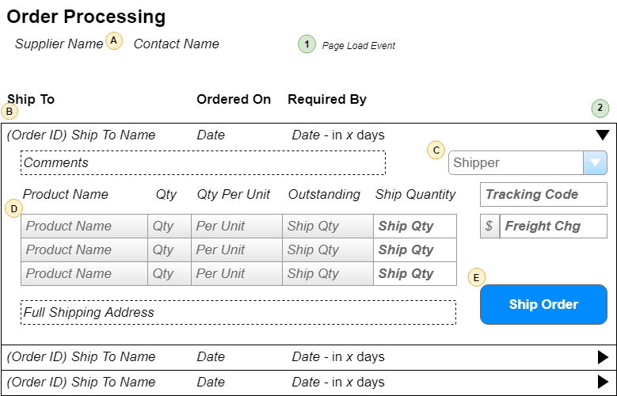

# Order Processing

> Orders are shipped directly from our suppliers to our customers. As such, suppliers log onto our system to see what orders there are for the products that they provide.

## User Interface

Suppliers will be interacting with a page that shows the following information.


The information shown here will be displayed in a **ListView**, using the *SelectedItemTemplate* as the part that shows the details for a given order.

## Events and Interactions



-  - **Page_Load** event
    -  = Supplier/Contact names obtained
    from who the logged-in user is.
    -  - Load the ListView data
    - **`List<OutstandingOrder>OrderProcessingController.LoadOrders(supplierId)`**
    -  - Load the list of shippers from BLL
        - **`List<ShipperSelection>OrderProcessingController.ListShippers()`**
-  - **EditCommand** click event
    - Default EditCommand behaviour of the ListView
    - `<EditItemTemplate>` will display the extended information of the products  and other details of the order.
-  - **ShipOrder** click
    - Use a custom command name of "ShipOrder" and handle in the ListView's `ItemCommand` event.
    - Gather information from the form of the products to be shipped and the shipping information. This is sent to the following method iun the BLL for processing:
        ```csharp
        void OrderProcessingController.ShipOrder(int orderId, ShippingDirections shipping, List<ShippedItem> items)
        ```

## POCOs

The POCOs/DTOs are simply classes that will hold our data when we are performing Queries or issuing commands to the BLL.

### Commands

```csharp
public class ShippingDirections
{
    public int ShipperId { get; set; }
    public string TrackingCode { get; set; }
    public decimal? FreightCharge { get; set; }
}
```

```csharp
public class ShippedItem
{
    public int ProductId { get; set; }
    public int ShipQuantity { get; set; }
}
```


### Queries

```csharp
public class ShipperSelection
{
    public int ShipperId { get; set; }
    public string Shipper { get; set; }
}    
```

```csharp
public class OutstandingOrder
{
    public int OrderId { get; set; }
    public string ShipToName { get; set; }
    public DateTime OrderDate { get; set; }
    public DateTime RequiredBy { get; set; }
    public int DaysRemaining { get; } // Calculated
    public IEnumerable<OrderItem> OutstandingItems { get; set; }
    public string FullShipppingAddress { get; set; }
    public string Comments { get; set; }
}
```

```csharp
public class OrderItem
{
    public int ProductID {get;set;}
    public string ProductName {get;set;}
    public short Qty {get;set;}
    public string QtyPerUnit {get;set;}
    public short Outstanding {get;set;} // Calculated as OD.Quantity - Sum(Shipped qty)
}
```

## BLL Processing
